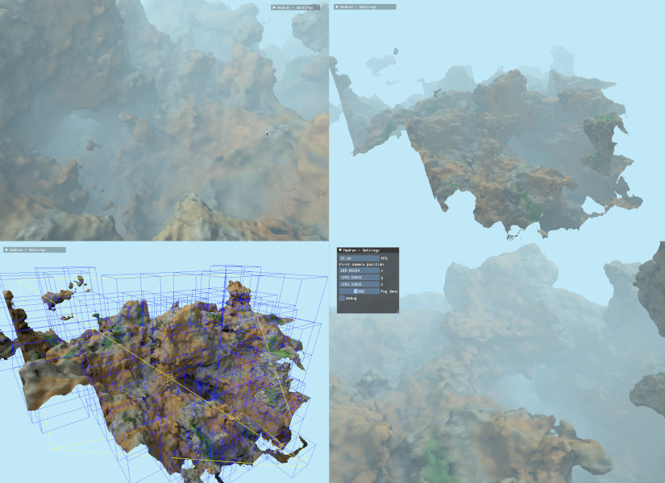

Hadron
======



This toy project currently aims at implementing the procedural terrain generation described in
[GPU Gems 3](https://developer.nvidia.com/gpugems/gpugems3/part-i-geometry/chapter-1-generating-complex-procedural-terrains-using-gpu "Chapter 1. Generating Complex Procedural Terrains Using the GPU").
It's a work in progress which relies on [an experimental version of GPipe](https://github.com/Chatanga/GPipe-Core/tree/experimental)
to handle missing features such as geometry shaders and transform feedbacks.
A [slightly modified version of GPipe-GLFW](https://github.com/Chatanga/GPipe-GLFW) to integrate [a Dear ImGui binding](https://github.com/haskell-game/dear-imgui.hs) is also needed.

**Controls:**

* Left mouse drag: look around
* W: forward
* A: left
* S: backward
* D: right
* SPACE: up
* CTRL: down
* TAB: next camera

Note: keyboard mapping is _not_ taken into account.

Build
-----

Install native packages on Ubuntu (more or less):

* mesa-common-dev
* libgl1-mesa-dev
* libxi-dev
* libxrandr-dev
* libxcursor-dev
* libxinerama-dev
* libglu-dev
* zlib1g-dev
* libglfw3-dev

Retrieve source packages:

``` bash
git clone git@github.com:Chatanga/Hadron.git
git clone git@github.com:Chatanga/GPipe-Core.git
git clone git@github.com:Chatanga/GPipe-GLFW.git
git clone git@github.com:haskell-game/dear-imgui.hs.git
cd dear-imgui.hs
git submodule init
git submodule update
cd ..
```

Build Hadron and its dependencies:

``` bash
cd Hadron
stack build
```

Run it:

``` bash
stack exec Hadron
```

References
----------

- [GPipe is dead, long live GPipe!](http://tobbebex.blogspot.com/2015/09/gpipe-is-dead-long-live-gpipe.html)
- [GPipe: Typesafe functional GPU graphics programming](http://hackage.haskell.org/package/GPipe)
- [linear: Linear Algebra](http://hackage.haskell.org/package/linear)
- [JuicyPixels: Picture loading/serialization (in png, jpeg, bitmap, gif, tga, tiff and radiance)](http://hackage.haskell.org/package/JuicyPixels)
