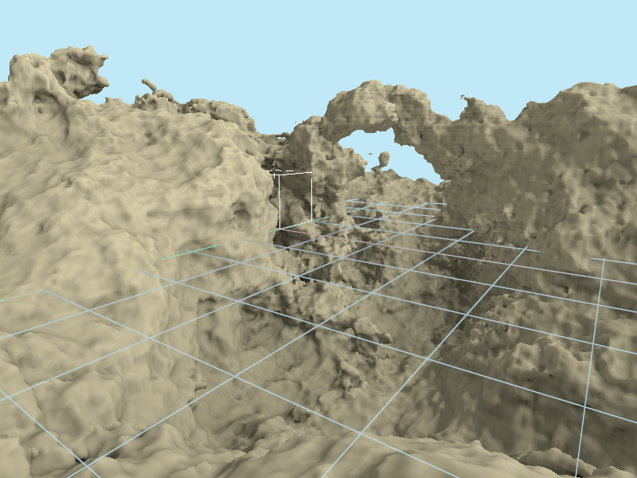

Hadron
======

This toy project currently aims at implementing the procedural terrain generation described in
[GPU Gems 3](https://developer.nvidia.com/gpugems/gpugems3/part-i-geometry/chapter-1-generating-complex-procedural-terrains-using-gpu "Chapter 1. Generating Complex Procedural Terrains Using the GPU").
It's a work in progress which relies on [an experimental version of GPipe](https://github.com/Chatanga/GPipe-Core/tree/transform-feedback)
to handle missing features such as geometry shaders and transform feedbacks.

**Controls:**

* Left mouse drag: look around
* W: forward
* A: left
* S: backward
* D: right
* SPACE: up
* CTRL: down
* TAB: next camera

Note: keyboard mapping is _not_ taken into account.

References
----------

- [GPipe is dead, long live GPipe!](http://tobbebex.blogspot.com/2015/09/gpipe-is-dead-long-live-gpipe.html)
- [GPipe: Typesafe functional GPU graphics programming](http://hackage.haskell.org/package/GPipe)
- [linear: Linear Algebra](http://hackage.haskell.org/package/linear)
- [JuicyPixels: Picture loading/serialization (in png, jpeg, bitmap, gif, tga, tiff and radiance)](http://hackage.haskell.org/package/JuicyPixels)
